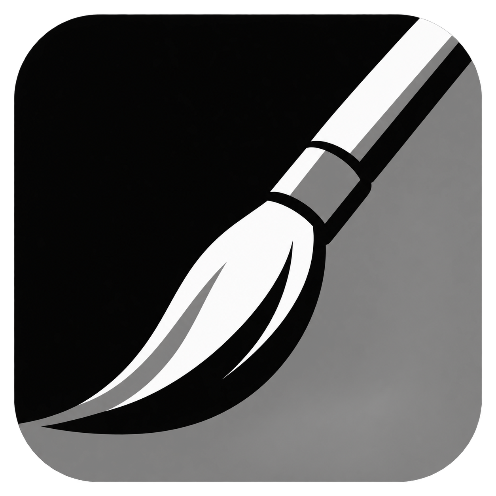

# MonoPaint



A small drawing app for **Supernote Manta**. Pressure-sensitive brushes, textured
pencil, dotted grayscale shading, and a blending stump for sketching on e-ink.

[Download the latest APK](https://github.com/mpdairy/monopaint/releases/latest/download/monopaint.apk)
· [Release notes](https://github.com/mpdairy/monopaint/releases)

## What it does

- Round, Flat, and Filbert brush heads with adjustable size and pressure response.
- Canvas wetness and opaque/transparent paint work with the normal brush.
- Wet strokes blend into existing paint; transparent strokes build up darkness.
- Tilt pencil, gradual eraser, flood fill, and directional blending stump.
- Eraser color for removing paint with your current brush, pencil, or airbrush.
- Soft airbrush with pressure-controlled strength, fixed size, and timed buildup.
- 65 grayscale dot densities, including pure black and white.
- Eyedropper for visible shades and a configurable toolbar.
- Gradient fill with live color selection; lift the pen to finish.
- Lines, rectangles, squares, ovals, and circles with simple outlines or solid fills.
- Custom tools, drag-to-reorder toolbar, undo/redo, and multi-page drawings.
- Up to eight layers per page, with names, visibility, ordering, and undoable deletion.
- Local saves and automatic recovery. No account or network permissions.
- Tap-to-rotate suggestions, with a landscape layout for either drawing hand.

Tap **Layers** (the stacked sheets in the toolbar) to open the
layer panel beside the tools. **Add layer** makes a transparent layer above the
selected one. Tap a layer name to select it and return to drawing. The top row
is the topmost layer; **Show** toggles visibility, and **Move up / Move down**
changes which marks cover others. You can rename or delete the selected layer.
Undo also reverses layer changes and restores deleted artwork.

All tools, including flood fill, wet blending, and **Clear layer**, affect only
the selected layer. The eraser reveals layers underneath; opaque white paint
covers them. Show a hidden layer before drawing on it. A simple starting point
is a sky on the bottom layer, scenery above, and details on top.

Layers, visibility, and the selected layer save separately for every page.
Existing drawings open unchanged as **Layer 1**. New saves use a layered page
format that older app versions cannot read. PNG exports combine visible layers.

Select **Fill**, then tap it again to open its settings beside the icon and
choose **Linear** or **Circular**. The choice is remembered for each tool or preset.

With **Fill** selected:

- Tap for solid fill.
- Drag a line for gradient, then choose a second color. For Circular, drag from
  the center to the outer edge.

The direction line stays visible until you begin choosing the second color.
Hold and slide on the color bar, or use the eyedropper, to preview it. Lift to finish. Undo reverses the whole fill. Fill uses the selected
layer and its tolerance.

Select **Shapes**, then tap it again to open its choices and current settings
beside the toolbar. Choose **Line**, **Rectangle**, **Square**, **Oval**, or **Circle**.
Its toolbar icon always shows the selected shape, including in saved shortcuts. Tap × or outside the panel to close it.
Drag on the canvas to size the live preview; lift to finish. The preview follows
the latest pen position and commits to the layer only when you lift. Squares and circles
keep equal width and height in any drag direction. **Outline** leaves the inside
empty, with a **1–128 px** width; **Filled** paints one solid shape in the current
color. Lines always use the width setting. Shapes paint opaquely on the selected
layer, including white, and each shape is one undo action. Leaving an unfinished
preview cancels it. Shape settings work with saved custom tools and toolbar
visibility/order.

Select **Airbrush** for a smooth spray of the current shade. Press harder for
stronger spray; hold still or move slowly to build color. Its side panel sets
**Diameter** (fixed size) and **Flow** (buildup rate). Fast strokes paint immediately with
smooth, continuous spray. Airbrush lays translucent
paint on the selected layer, including white. Select the eraser color for soft
erasing with the same diameter and flow. Airbrush uses its own flow and does not use brush wetness or the
opaque/transparent brush modes. Each spray stroke is one undo action.

Every drawing tool and custom shortcut uses the same interaction: tap to select,
then tap the selected tool again to open its settings beside the icon. The first
selection leaves the canvas ready to draw. Brush settings show Round / Flat /
Filbert choices with the current controls underneath; Shapes works the same way.
Both regular and custom icons follow the selected brush tip or shape immediately.
Changing a shortcut preserves the regular tool's separate settings and icon.
Panels fit either toolbar side in all four rotations. Tap × or outside to close.
**Add to Toolbar** saves a custom tool, and its settings save automatically when
edited. Favorites keep their settings separate from the regular tools. Matching
favorite icons have one dot, two dots, and so on in toolbar order. Hold and drag
custom tools to reorder them. For thinner light strokes,
move **Pressure response** toward **Firm touch**; 50% keeps the original response.

**Zoom** shows the current percentage and a small padlock. Zoom and pan start
locked to prevent accidental movement while drawing. Tap to unlock, then pinch
with two fingers to zoom or drag with two fingers to pan. Pinch inward to fit the
whole page. Tap again to lock the current view; pen drawing works in either state.
The lock updates immediately through the fast e-ink path and your choice is saved.
Zoom has no settings panel and retains the selected drawing tool or shortcut.

**Menu → Settings → Settings text size** offers **Medium** (the default) and
**Large**. Tool panels, Layers, Palette, and the main settings use the same size
choice, with bold control labels and plain helper text. Panels omit redundant
tool-name headings. Text size is independent of the sidebar icon size.

**Menu → Settings → Toolbar** shows each tool's icon with a visibility checkbox
and up/down arrows. Show, hide, or reorder Brush, Pencil, Airbrush, Fill, Shapes, Eraser, Blending
stump, Layers, Zoom, and Palette. All start visible; keep at least one painting tool enabled.
Hidden tools keep their settings and position, and custom tools remain in their
own section. Hiding the selected regular tool switches to another visible tool.
Your choices persist in every orientation and drawing-hand layout.

Tap the **Palette** icon to arrange a small set of grayscale swatches. Its grid
opens beside the icon and stays open while you use the main color bar: tap an existing swatch to edit it,
or select the dashed empty box and choose a color to add one. The color selector
moves normally while you hold the pen; lifting updates and saves the swatch. An empty selection
shows “Select a color” after three seconds. Drag a swatch onto another to insert
before it, onto the empty box to move it to the end, or into the trash to delete.
Deletion closes gaps; tapping the trash does nothing. Close with **×** or tap
outside. Up to 16 swatches save automatically. Tap a sidebar swatch to choose
its shade while keeping the current brush or preset.

**Settings → Side toolbar icon size** offers **Medium** and **Large** (the default).
This also sizes Layers, Zoom, and custom tool icons. Both sizes fit the same
buttons, keeping the canvas area and top controls unchanged.

Each brush head remembers its own width and pressure response. Flat has a square
edge; Filbert has a full, rounded oval footprint. Flat and Filbert always
follow pen tilt, keeping the broad edge perpendicular to your lean. Leaning down
gives a wide downstroke, with a fine sideways stroke for Flat and a fuller
rounded mark for Filbert. Near upright, the brush keeps
its last direction. This reads lean direction, not barrel twist.

Flat has a maximum width of 256px and a **Height** slider. Its lowest setting is
a fixed 1px edge; higher settings use 1–20% of the current pressure-sized width,
never less than 1px. Choose 10% for the old proportion or 20% for twice that.
Existing tools start at 1px; regular Flat and each favorite remember height
independently. Filbert keeps its fuller rounded contact.
Pressure controls width between the configured minimum and maximum.
Pen tilt only rotates the head; leaning farther does not enlarge or shift it.
Their compact settings contain minimum width, maximum width, and pressure response,
plus height for Flat. Older presets use this automatic tilt behavior too, with no
angle offset. The toolbar and saved custom tools show the selected head icon.

Brush footprints are solid: bristle streaks and their control are disabled for
now, including in existing presets. Raise **Minimum width** for broad strokes
with a light touch.

The **water droplet left of the color bar** toggles wet canvas mode. Its dot means
wet-in-wet is on. Use the normal brush with any head: fresh strokes appear
immediately, then blend with existing paint over a few seconds. Small strokes
blend live while you draw. Blending uses spare drawing time and slows down or
briefly pauses for larger strokes, busy wet areas, or delayed pen input. It catches
up after you lift the pen. Slide the narrow
black bar beside the outlined droplet upward for more blending, downward for less.
Touching or dragging the bar above zero enables wet mode; zero switches it off.
The droplet can also turn blending off while remembering the bar's strength.
Tapping it again uses that strength, or restores medium wetness if the bar is zero.

The two overlapping-square icons **beyond the eraser color** choose **Transparent** (overlapping
outlines) or **Opaque** (solid square). Opaque is the default and covers with the
selected shade, including white. Transparent adds a half-strength multiply glaze:
white adds no pigment, even black stays translucent, and separate strokes
build density. Overlapping stamps within one stroke do not repeatedly darken it.
On a wet canvas, transparent white acts as clear water and blends existing paint.
The color bar's marker indicates the selected shade; there is no extra preview square.

Tap the **eraser beside the white end of the color bar** to erase with the current
brush head, pencil, or airbrush. The color marker moves under the eraser icon.
Erasing reveals the layers underneath and keeps your tool's shape, size, pressure,
and other settings. Tap a shade, even the one previously selected, or accept an
eyedropper sample to paint again. Wet paint settles before erasing; wetness and
transparency settings are retained for painting. The mode follows supported tools
and favorites and survives reopening the app. Fill, Blending stump, and the
standalone Eraser return to their usual behavior and disable the eraser color.
The standalone **Eraser** and saved eraser favorites remain available.

The **eyedropper left of the color bar** samples the visible artwork. Tap it,
then hold and drag the pen across the canvas: the color marker follows what you
sample. Lift to keep that color and return to your previous tool. Sampling
leaves no marks. During a gradient fill, it previews the second color and
finishes the fill on release, sampling the artwork underneath the preview.

The left rail now contains Brush, Pencil, Fill, Eraser, and Blending stump plus your custom
tools. Older watercolor and wash presets keep their brush shape and settings and
use the canvas wetness and paint mode controls. Wetness and transparency are global
brush controls, independent of the selected head or preset.

Undo removes a wet stroke together with its animation. Undo/Redo, other painting
tools, clearing, changing pages, saving a named drawing, or leaving the app stop
ongoing animation. Your wetness and paint mode choices persist; the next brush
stroke can mix with existing paint again when the droplet is on. Animation work
is bounded to keep the pen responsive; this is grayscale blending, not fluid physics.

Tool, shade, wetness, and paint mode selections always use instant e-ink feedback.
Controls fall back to ordinary display refresh when direct feedback is unavailable.

Turn the tablet and hold it at the new angle briefly: a **rotation-arrows button
beside the file menu** appears. Tap it to accept the suggested orientation.
Turning alone never rotates the page. Turn back toward portrait to get a return
suggestion. A flat tablet has no reliable gravity direction; **Menu → Settings →
Turn to landscape / Turn to portrait** also works without a sensor suggestion.

**Settings → Drawing hand** places the controls opposite your hand. Right-handed
mode uses a left tool rail in portrait; in landscape the former top toolbar goes
on the left, with the menu and undo controls at the top and page controls at the
bottom. In right-handed mode, the tools keep their original tablet edge with
upright icons: turning the right edge down puts them along the top; turning the
left edge down puts them along the bottom. Left-handed mode puts the side toolbar
on the right and keeps the tools at the top in either landscape direction.
The file menu stays in the outer top corner, with the rotation suggestion beside
it toward the other controls. Its menu opens directly below the hamburger in
every orientation. Existing Toolbox side preferences carry over.
The artwork stays fixed relative to the tablet, like a sheet of paper; only the
controls turn upright. Changing your drawing hand also leaves the artwork's
orientation unchanged. Rotation keeps the page, tools, and undo history, fitting
the whole page into the available canvas. Android itself stays locked to portrait:
the app draws its controls and settings sideways. All four app orientations use
the same fast Manta e-ink drawing path. Normal-size pages submit their original
bitmap directly, without rotating a full image for each pen update. Instant
selection dots also work with rotated controls, and the landscape shade strip
keeps white at the top and black at the bottom, with its black selection marker
on the inner edge facing the canvas for either drawing hand.

Tap **Zoom** to unlock navigation, then pinch with **two fingers** to zoom, or drag
both fingers together to pan. The pen continues to paint at the same size in the drawing; one finger leaves the canvas
alone. Lift the pen away from the screen before navigating, since pen contact
and nearby hover suppress touch navigation.

The **Zoom** button shows the current percentage and a closed/open padlock.
Tap it to lock or unlock both gestures; the view stays where it is. Navigation
starts locked and remembers your choice. Pinch inward to fit the whole page.
100% means one drawing pixel per screen pixel, with a maximum of 800%. The view
stays within the page edges. Opening/changing pages or rotating returns to the
whole page. Zoom changes only the view, preserving drawing pixels and undo.
Pinch and pan use a direct e-ink preview that follows the latest finger position.
Queued movement is combined into one current frame; the percentage uses fast
feedback too. The preview keeps full-resolution calibrated shades, and lifting
your fingers finishes the latest view before the next pen stroke.

## Sideload onto a Manta

1. Download **monopaint.apk** from the latest release (not the source ZIP).
2. Install Google's [Android SDK Platform Tools](https://developer.android.com/tools/releases/platform-tools)
   on your computer and open a terminal in the folder containing `adb`.
3. On the Manta, turn on **Settings → Security & Privacy → Sideloading**.
   Connect it by USB, unlock it, and accept the debugging prompt if one appears.
4. Run the commands below, replacing the APK path with your download location:

   ```sh
   adb devices
   adb install -r /path/to/monopaint.apk
   adb shell am start -n dev.tilesmile.supernote.paint/io.github.mpdairy.monopaint.PaintActivity
   ```

   On Windows PowerShell, use `./adb.exe`; on macOS/Linux, use `./adb` if it
   isn't on your PATH. If multiple devices appear, add `-s SERIAL` after `adb`.
   If a device is `unauthorized`, approve the prompt on the tablet and retry.

For updates, repeat `adb install -r` with the new APK. The app ID remains
`dev.tilesmile.supernote.paint`, so releases signed with the existing key also
update the earlier TileSmile and Mattelier apps.
Do not uninstall first: uninstalling deletes the app's private drawings.

## Saving and organizing drawings

**Menu → Save drawing** asks for a name and folder the first time. Later saves
update that same drawing directly. **Save drawing as…** saves to a chosen name or
folder and makes it the current save destination. Replacing an existing drawing
through Save As requires confirmation; ordinary Save does not.

**Open drawing** and **Save drawing as…** browse the drawing library. Tap a folder
to enter it, **Up** to return to its parent, or **New folder** to create a subfolder.
Existing drawings remain at the top level. Save As can put a copy of an existing
drawing in a folder; it keeps the original copy.

Each named drawing is one `.tsm` file containing all its pages. It is a ZIP archive
with a binary manifest (dimensions, page count and selected page) and compressed,
checksummed grayscale pixel data per page—not XML, PNGs, or a history of pen strokes.
The display's dot pattern is regenerated from the grayscale data. Automatic
recovery stores the working pages and their save destination together, so Save
continues updating the same drawing after a restart. Older recovery files still
open, but need a name on their first save because they did not record one.

Folders are inside MonoPaint's private storage, not the tablet's shared file
browser. Uninstalling the app removes them. PNG conversion on a computer is
documented in [the development guide](docs/BUILDING.md#png-conversion).

## Current limits

This is an early, unofficial app tested on **Manta (1920 × 2560, arm64)**.
The direct display path is Manta-specific; Nomad and other tablets are unverified.
There is no in-app image export yet. Drawings live in the
app's private storage, and undo history does not survive a restart.

## Nomad testers wanted

If you try MonoPaint on a Nomad, [open an issue](https://github.com/mpdairy/monopaint/issues)
with your firmware and app versions, whether pressure/tilt works, and how live
ink, grays, and selection refreshes behave. Test on a new drawing first. The fast
display path currently requires the Manta screen layout; Nomad may use the slower
Android drawing fallback. Nomad support is not yet verified.

## Development and license

See [building, testing, and publishing](docs/BUILDING.md) and
[contributing](CONTRIBUTING.md). Technical research notes are in [docs](docs/).
Earlier notes use the working names TileSmile and Mattelier; compatibility details
are in the [development guide](docs/BUILDING.md#project-names-and-compatibility).

[MIT licensed](LICENSE). The pen bridge includes MIT-licensed work from
[AnimInk](https://github.com/YoramDevGH/AnimInk); its attribution is retained in
[THIRD_PARTY_NOTICES.md](THIRD_PARTY_NOTICES.md) and inside the APK.
