# MonoPaint tools and features

How to use each tool: tap a tool to select it, then tap it again to open its
settings beside the icon. Tap × or anywhere outside the panel to close it.

## Drawing tools

| Tool | What it does |
|:-:|---|
| 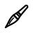 **Brush** | Pressure-sensitive brush. Settings: head, min/max width, pressure response, **Oil paint**. Works with wet canvas and the opaque/transparent modes. |
|  **Brush pen** | Lays down clear water that lifts and drags the paint underneath. Tilt sets its size and pressure sets how much paint it pulls. Edges stay sharp on a dry canvas, and on a wet canvas it blends into the wet paint. Settings: Strength, Pressure response, Carry original paint. |
|  **Pencil** | Textured pencil. Leaning the pen broadens the stroke (**Broaden with tilt**). Settings: Hardness (soft = darker), upright tip size. |
| 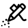 **Airbrush** | Soft spray at a fixed size. Press harder for stronger spray, and hold still or move slowly to build color. Settings: Diameter, Flow. |
| 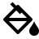 **Fill** | Flood fill. Tap it again to pick the fill type (below). |
|  **Shapes** | Line, rectangle, square, oval or circle (below). |
| 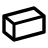 **Eraser** | Gradual eraser that reveals the layers underneath. Settings: Softness. |
|  **Blending stump** | Pulls shading in the direction you rub. Lower strength blends more gently, and you can repeat passes to build it up. |

### Brush heads

The toolbar icon changes to match the selected head. Each head keeps its own
width and pressure settings.

| Head | |
|:-:|---|
|  **Round** | Even in every direction. |
| 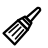 **Flat** | Square edge that turns to follow pen tilt. Extra **Height** setting (1 px, or 1–20% of the width). |
| 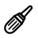 **Filbert** | Rounded oval that follows pen tilt. With oil paint it becomes a crescent shape. |

**Oil paint:** the brush starts each stroke loaded with your shade and runs out
along the stroke. As it empties it lays down more of the paint it picks up from
the canvas, and once empty it only smudges. To reload, rub the pen around in the
color bar or on a palette swatch. **Minimum load** sets how much a single tap
loads, and **Loading speed** sets how fast rubbing adds paint.

### Fill types

| Type | |
|:-:|---|
|  **Flat fill** | Tap to fill a region with the current shade (exact tone match). |
| 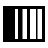 **Linear gradient** | Drag along the gradient, then slide on the color bar to choose the second color. Lift to finish. |
|  **Circular gradient** | Drag from the center to the edge, then choose the second color. |

The gradient fills have a **Tolerance** setting. Choose the eraser color as
either end of a gradient to fade the fill to transparent.

### Shapes

| | | | | |
|:-:|:-:|:-:|:-:|:-:|
|  |  | 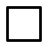 | 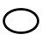 | 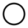 |
| Line | Rectangle | Square | Oval | Circle |

Drag to size the shape and lift to finish. A circle starts at its center.
Choose **Outline** (1–128 px width) or **Filled**. Shapes always paint opaque.

## Color controls

| Control | What it does |
|:-:|---|
| **Color bar** | 65 grayscale dot densities, from white to black. The marker shows the selected shade. |
|  **Eraser color** | The eraser at the white end of the color bar. Your current brush, pencil, airbrush, shape or fill erases instead of painting. Tap any shade to paint again. |
|  **Eyedropper** | Hold and drag the pen over the artwork to sample a shade, and lift to keep it. |
| 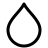 **Wet canvas** | Turns wet-in-wet blending on or off (a dot means on). Slide the bar next to it to set how wet the canvas is. New brush strokes blend with existing paint over a few seconds. |
|  **Opaque** | Paint covers what's underneath, white included. This is the default. |
| 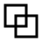 **Transparent** | A half-strength glaze that darkens with each separate stroke. On a wet canvas, transparent white works as clear water. |

**Wet canvas uses gravity** (Settings) makes wet paint run downhill as you tilt
the tablet.

## Toolbar extras

| Item | What it does |
|:-:|---|
|  **Layers** | Up to 8 layers per page. You can add, rename, reorder and delete layers, and set opacity.  /  toggles visibility. Every tool works on the selected layer only. |
|  **Zoom** | Tap to unlock, then pinch with two fingers to zoom (up to 800%) or drag with two fingers to pan. Pinching inward fits the whole page. Tap again to lock. |
|  **Palette** | Up to 16 saved swatches. Tap a swatch to edit it, drag to reorder, or drag to the trash to delete. |
| **Custom tools** | **Add to Toolbar** saves the current tool and its settings as a shortcut. Hold and drag shortcuts to reorder them. |

## Header

| Control | What it does |
|:-:|---|
|  **Menu** | New, Open, Save, Save as, and Settings. Drawings can go in folders. |
| 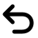 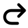 **Undo / Redo** | Covers strokes, fills, layer changes and clears. |
|  **Clear** | Clears the current layer or all layers. Undo restores them. |
|   **Pages** | Previous/next page and Add page. Tap the page number to see a thumbnail grid. |
| 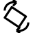 **Rotate** | Shows up briefly after you turn the tablet. Tap it to rotate the controls. The artwork stays put like a sheet of paper. |

## Settings

Open these from **Menu → Settings**:

- **Drawing hand**: puts the controls on the side opposite your hand.
- **Turn to landscape / portrait**: rotates without using the tilt sensor.
- **Side toolbar icon size** and **Settings text size**: Medium or Large.
- **Wet canvas uses gravity**: makes wet paint flow downhill.
- **Nomad Simulation Mode** (Manta only): previews the smaller Nomad screen size.
- **Toolbar**: show, hide and reorder the built-in tools.

## Saving

Drawings save to the app's private storage as `.tsm` files, with all pages in
one file. Work in progress is recovered automatically after a restart. The undo
history does not survive a restart. To convert a drawing to PNG on a computer,
see [BUILDING.md](BUILDING.md#png-conversion).
